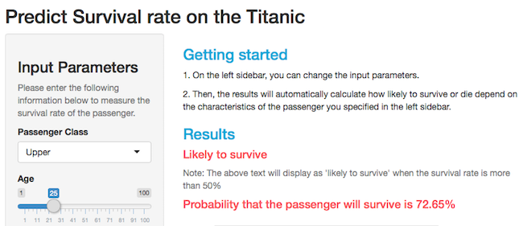

## Background
- The sinking of the RMS Titanic is one of the most infamous shipwrecks in history.  On April 15, 1912, during her maiden voyage, the Titanic sank after colliding with an iceberg, killing 1502 out of 2224 passengers and crew.
- This sensational tragedy shocked the international community and led to better safety regulations for ships.

--- .class #id 

## Overview
- This data product provides the basic model to predict the probability that the passengers on the Titanic will survive. 
- The data used to train this model is on Kaggle's Titanic challenge, which you can download from Kaggles's page:
    - https://www.kaggle.com/c/titanic

--- .class #id 

## Logistic Regression
- The technique that used to build this model called **the Logistic Regression**.
- For more information, please visit the following link:
    - http://en.wikipedia.org/wiki/Logistic_regression

--- .class #id 

## Titanic Dataset

- Preview of the Titanic dataset


```r
data <- read.csv("titanicTrain.csv",header = TRUE)
str(data)
```

```
## 'data.frame':	891 obs. of  12 variables:
##  $ PassengerId: int  1 2 3 4 5 6 7 8 9 10 ...
##  $ Survived   : int  0 1 1 1 0 0 0 0 1 1 ...
##  $ Pclass     : int  3 1 3 1 3 3 1 3 3 2 ...
##  $ Name       : Factor w/ 891 levels "Abbing, Mr. Anthony",..: 109 191 358 277 16 559 520 629 417 581 ...
##  $ Sex        : Factor w/ 2 levels "female","male": 2 1 1 1 2 2 2 2 1 1 ...
##  $ Age        : num  22 38 26 35 35 NA 54 2 27 14 ...
##  $ SibSp      : int  1 1 0 1 0 0 0 3 0 1 ...
##  $ Parch      : int  0 0 0 0 0 0 0 1 2 0 ...
##  $ Ticket     : Factor w/ 681 levels "110152","110413",..: 524 597 670 50 473 276 86 396 345 133 ...
##  $ Fare       : num  7.25 71.28 7.92 53.1 8.05 ...
##  $ Cabin      : Factor w/ 148 levels "","A10","A14",..: 1 83 1 57 1 1 131 1 1 1 ...
##  $ Embarked   : Factor w/ 4 levels "","C","Q","S": 4 2 4 4 4 3 4 4 4 2 ...
```

--- .class #id 

## Getting Started
- On the left sidebar, you can change the input parameters.
- Then, the results will automatically calculate how likely to survive or die depend on the characteristics of the passenger you specified in the left sidebar.
- Link to ShinyApp: https://benzzers.shinyapps.io/TitanicApp/ 




